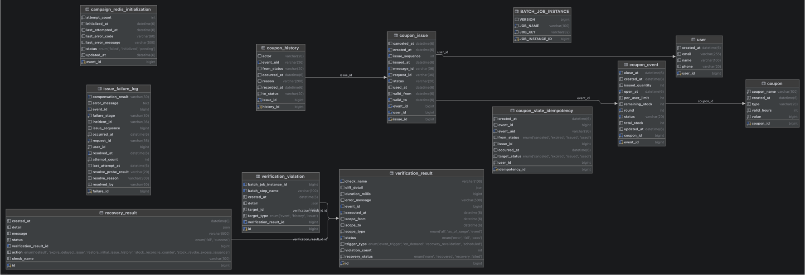
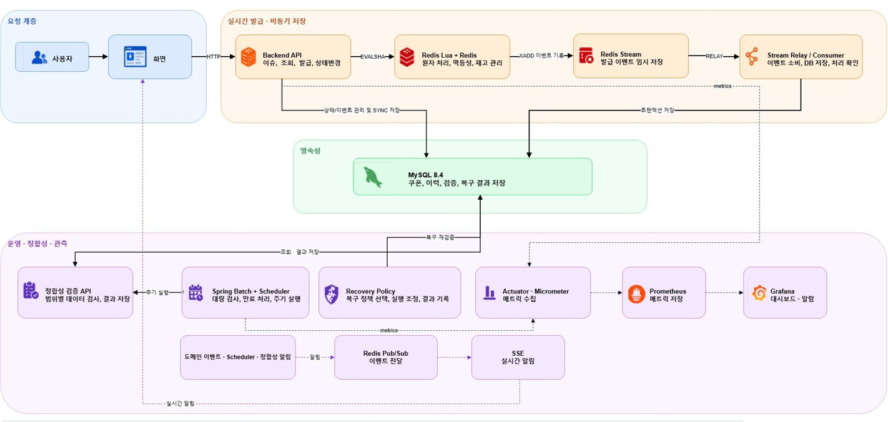
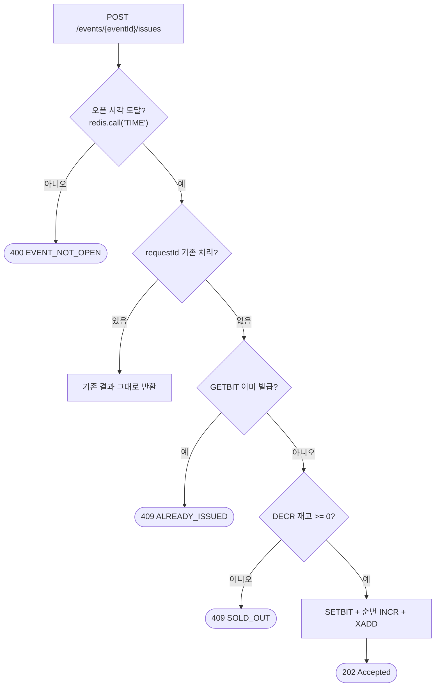
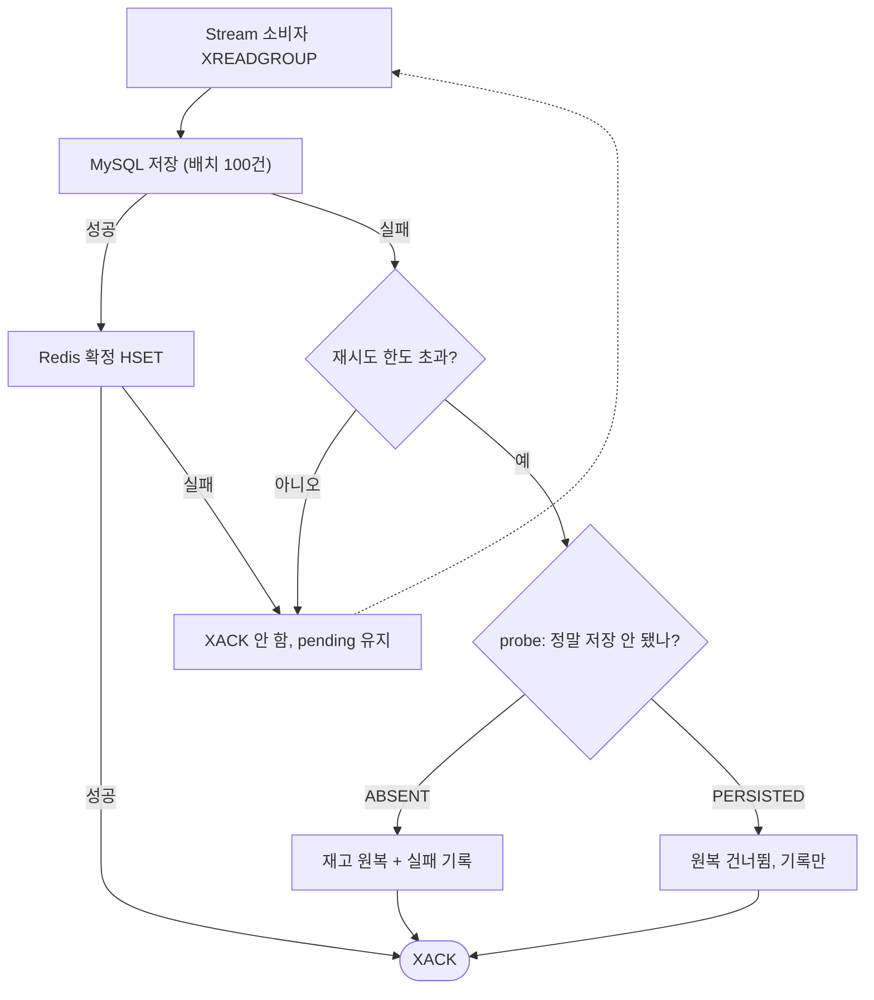
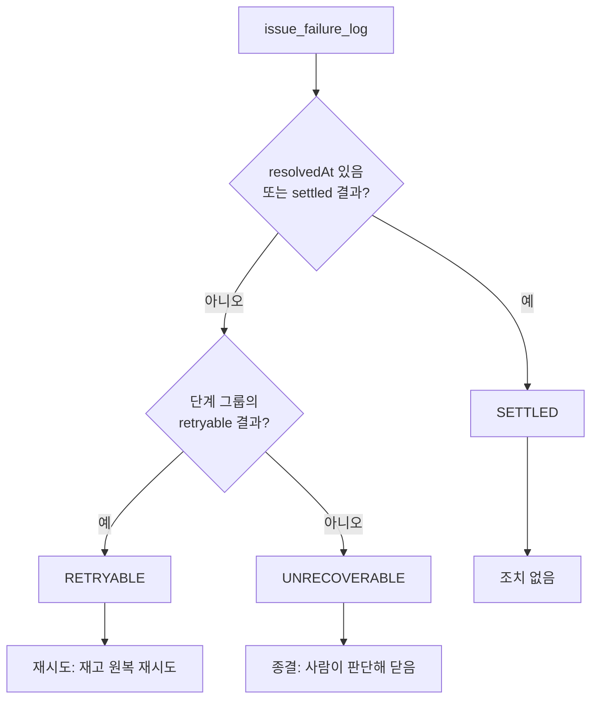
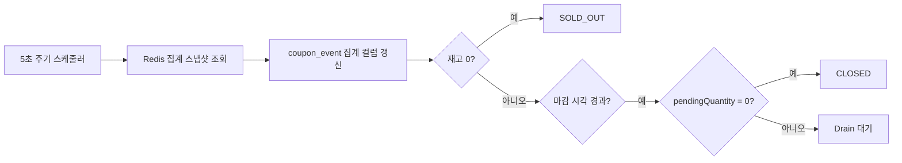
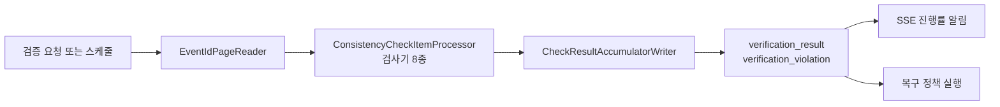

# Ace_BE

**매일 정오, 10,000장 한정 쿠폰을 20,000명이 동시에 받으러 오는 선착순 발급 서버**입니다.
Redis Lua 스크립트가 재고 판정을 원자적으로 끝내고, MySQL 저장은 Redis Stream 소비자가 요청 밖에서 처리합니다.


> LG U+ 프리덤 데이를 소재로 한 교육용 가상 시나리오이며 실제 서비스와 무관합니다.

---

## 프로젝트 개요

**커머스에서 트래픽이 가장 집중되는 순간인 선착순 쿠폰 발급을 소재로, 동시성과 정합성을 다룬 프로젝트입니다.**

재고 10,000장에 20,000명이 동시에 몰릴 때 초과 발급이 한 건도 나오지 않아야 하고,
그 결과가 **300만 건 규모의 기존 데이터 위에서도 어긋나지 않았음을 증명할 수단**까지 있어야 합니다.
"빠르다"만으로는 부족하고 "틀리지 않았다"를 보일 수 있어야 한다는 것이 이 프로젝트의 출발점입니다.

그래서 시스템을 두 갈래로 만들었습니다.
발급 경로는 판정과 저장을 분리해 응답을 먼저 주고, **정합성 검증 경로**는 그렇게 벌어진 틈을 사후에 전수 검사합니다.
검증팀은 위반을 직접 주입하는 도구까지 만들어, 검사기가 실제로 위반을 잡아내는지 자체를 검증합니다.

구조는 **의도적으로 두 단계**로 진행했습니다.
1차(`SYNC`)에서 병목을 측정하고, 2차(`RELAY`)에서 그 병목을 해결한 뒤 두 결과를 비교하는 것이 프로젝트의 핵심 서사이며,
두 구조는 지금도 **설정 한 줄로 갈아끼울 수 있게** 한 빌드에 남아 있습니다.

측정 결과는 별도 저장소 [`Ace_LT`](https://github.com/URECA-Ace/Ace_LT)에 있습니다.
AWS 실측에서 응답 p99는 4,311ms에서 1,038ms로, 커넥션 풀 대기 스레드는 135에서 0으로 바뀌었습니다.

## 시연 영상

https://github.com/user-attachments/assets/cd82fedc-eebe-47ab-b180-ffa4b06e614c

## 팀 구성 및 담당 역할

2026.08.06 ~ 08.31 동안 6명이 **발급팀 3명 / 정합성 검증팀 3명**으로 나눠 개발했습니다.
이슈에서 브랜치를 따고 PR로 합치는 흐름으로 협업했고, 커밋 컨벤션은 git hook으로 강제했습니다.

|  |  |  |
|:---:|:---:|:---:|
| **조성원** | **구지민** | **변우림** |
| [@ch0rca](https://github.com/ch0rca) | [@jimizip](https://github.com/jimizip) | [@woolimbyun](https://github.com/woolimbyun) |
| 발급팀 | 발급팀 | 발급팀 |
| Redis Lua 판정, 발급 API, 발급 현황 조회 | 발급 확정 및 저장, Stream Relay, DLQ, 공통 예외 | 캠페인 및 쿠폰 상태 관리, 조회 |

|  |  |  |
|:---:|:---:|:---:|
| **임진우** | **김태연** | **최정현** |
| [@gart09](https://github.com/gart09) | [@taeyeonon](https://github.com/taeyeonon) | [@jungchoib](https://github.com/jungchoib) |
| 정합성 검증팀 | 정합성 검증팀 | 정합성 검증팀 |
| 검사기, Spring Batch 파이프라인, 위반 주입, 알림 | 복구 정책 및 실행기, 검사기 | 검사기, 복구 정책 |

## 기술 스택

| 구분 | 기술 | 선택 이유 |
|---|---|---|
| Language | Java 21 | |
| Framework | Spring Boot 4.1, Spring Data JPA | |
| | **Spring JDBC** (`JdbcTemplate`) | 비동기 저장 경로는 100건 단위 배치 INSERT입니다. JPA `save()` 반복은 개별 INSERT 100회가 되어 배치의 의미가 사라지므로, 저장 구현만 `IssueWriter` 인터페이스로 분리해 교체했습니다 |
| | Spring Batch | 300만 건 전수 검증을 페이지 단위로 나눠 돌리고, 중단과 재시작이 가능해야 했습니다 |
| Database | MySQL 8.4 | 1인 1매, 순번 유일성, 요청 멱등을 **DB 유니크 제약**으로 최종 보증합니다. 애플리케이션 판정이 뚫려도 여기서 막힙니다 |
| In-memory | Redis 8.2 (Lua, Stream, Bitmap) | 재고 차감, 중복 검사, 순번 채번, 대기열 적재를 **한 스크립트 안에서 원자적으로** 끝냅니다. 판정과 저장 사이에 다른 요청이 끼어들 틈이 없습니다 |
| 관측 | Actuator, Micrometer, Prometheus, Grafana | 부하 중 서버 내부 상태(커넥션 풀 대기, 적체량)를 HTTP 조회 없이 읽어야 했습니다. 조회 자체가 톰캣 스레드를 뺏어 측정을 오염시키기 때문입니다 |
| 알림 | SSE (`SseEmitter`) | 관리자 화면에 검증 진행률과 발급 실패를 실시간으로 밀어줍니다. 단방향이라 WebSocket까지 갈 이유가 없었습니다 |
| Test | JUnit 5, Testcontainers | 정확성 검증은 실제 MySQL과 Redis가 있어야 성립합니다 |

## ERD

핵심은 **식별자 3종을 분리한 것**과 **이력 테이블을 append-only로 둔 것**입니다.



발급 도메인(`coupon` - `coupon_event` - `coupon_issue` - `coupon_history`)과

검증 도메인(`verification_result` - `verification_violation` - `recovery_result`)이 분리돼 있고,
`issue_failure_log`와 `campaign_redis_initialization`이 Redis와 MySQL 사이의 실패를 받아 둡니다.


| 식별자 | 생성 주체 | 막는 것 |
|---|---|---|
| `request_id` | 클라이언트 | 사용자와 네트워크의 재시도 |
| `message_id` | Redis Lua (`eventId:sequence`) | Stream 재전달로 인한 중복 저장 |
| `idempotency_key` | 클라이언트 | 사용 및 취소 API 재요청 |

`coupon_history`는 **UPDATE와 DELETE를 애플리케이션 레벨에서 차단**합니다.
`occurred_at`과 `recorded_at`을 나눠 둔 것은 비동기 저장 경로의 지연을 사후에 측정하기 위해서입니다.

스키마 원본: [`erd.sql`](erd.sql)

## 아키텍처



판정은 Redis에서, 저장은 요청 밖에서, 검증은 사후 배치에서 일어납니다.

| 계층 | 하는 일 |
|---|---|
| 실시간 발급 | Backend API가 `EVALSHA`로 Redis Lua를 호출해 원자 판정하고, 승인 건을 `XADD`로 Stream에 남긴 뒤 바로 응답합니다 |
| 비동기 저장 | `IssueStreamRelay`가 Stream을 소비해 MySQL에 저장하고 확정 처리합니다. `SYNC` 모드에서는 이 경로 대신 요청 스레드가 직접 저장합니다 |
| 정합성 | Spring Batch가 저장된 데이터를 전수 검사하고, 위반은 복구 정책이 받아 조정한 뒤 결과를 다시 MySQL에 남깁니다 |
| 관측 | Actuator와 Micrometer가 지표를 내보내고 Prometheus가 저장, Grafana가 대시보드를 그립니다. 운영 이벤트는 SSE로 화면에 밀어줍니다 |

## 주요 기능

### 1. 선착순 발급 판정 - Redis Lua 원자 처리

재고 확인과 차감이 분리되면 두 요청이 같은 재고를 보고 둘 다 통과합니다.
그래서 오픈 시각 검증부터 순번 채번, 대기열 적재까지를 **하나의 Lua 스크립트**로 묶어 원자적으로 처리합니다.



- 사용자 발급 여부는 **Bitmap**으로 관리합니다. `userId - 1`을 8,388,608 bit 세그먼트로 나눠 사용자 수가 늘어도 키 하나가 1 MiB를 넘지 않습니다
- 재고 차감과 Stream 적재가 같은 스크립트 안에 있어 **"재고는 줄었는데 대기열에 기록이 없다"가 구조적으로 불가능**합니다. 판정 통과 후 프로세스가 죽어도 기록은 이미 Stream에 있습니다

### 2. 발급 확정 및 저장 - 응답을 먼저 주고 저장은 뒤로

1차 구조는 요청 스레드가 MySQL 커밋까지 끝내고 응답했습니다.
그러면 톰캣 스레드 200개가 커넥션 65개를 두고 줄을 서고, 대기 스레드가 정확히 135개(200 - 65) 생깁니다.
저장을 요청 밖으로 빼면 그 줄 자체가 없어집니다.



- **실패 단계에 따라 보상 여부가 갈립니다.** 저장 실패는 원복 대상이지만 확정 실패는 저장이 이미 커밋된 상태라 원복하면 초과 발급이 됩니다. 후자는 `XACK`하지 않고 pending에 남겨 재확정을 기다립니다
- 원복 전에 **`probe`로 실제 저장 여부를 다시 확인**합니다. 원복을 빠뜨리면 재고 1장이 묶이지만, 잘못 원복하면 초과 발급이 됩니다. 판별하지 못한 건은 원복하지 않고 정합성 복구 대상으로 넘깁니다
- 인스턴스가 2대라 컨슈머 이름을 **호스트명 + PID**로 만듭니다. 이름이 겹치면 서로의 pending을 가져가 버리고, 죽은 컨슈머의 몫은 `claim-min-idle`이 지난 뒤 `XCLAIM`으로 회수합니다

### 3. 발급 실패 관제 (DLQ)

`issue_failure_log`는 쌓이고 있었지만 조회 수단이 없어 DB에 직접 붙는 것 외에는 볼 방법이 없었습니다.
운영자가 화면에서 실패를 확인하고 재시도하거나 종결할 수 있어야 했습니다.



- **`resolved_at`으로 미해소를 판정하지 않습니다.** 보상에 성공해도 `resolvedAt`은 채워지지 않기 때문입니다. 실패 주입 실측에서 생성된 8건 전부 `resolved_at IS NULL`이었고 그중 6건은 이미 재고가 돌아온 종결 건이었습니다. 이 기준을 쓰면 종결된 건이 화면에서 영원히 사라지지 않습니다
- 판정 기준은 `compensation_result`와 실패 단계 그룹의 조합입니다. 흩어져 있던 기준을 `IssueFailureStageGroup` 한 곳으로 모아 화면, API, 스케줄러가 같은 판정을 쓰게 했습니다

### 4. 회차 집계와 상태 전이

재고 차감은 Redis 안에서만 일어나므로 `coupon_event`의 집계 컬럼은 그대로 두면 영원히 갱신되지 않습니다.
그렇다고 발급 경로에서 건별로 UPDATE하면 같은 행의 잠금을 두고 경합이 생겨 판정을 Redis로 옮긴 의미가 사라집니다.



- **`CLOSED` 전환에 Drain 게이트를 둡니다.** 저장이 아직 밀려 있는데 회차를 닫으면 정합성 검증이 "손실"로 판정합니다. `pendingQuantity`가 0으로 돌아와야 닫습니다
- 확정 실패가 회수되지 않으면 `pendingQuantity`가 0이 되지 않아 회차가 영원히 안 닫힙니다. 그래서 확정 실패 재처리 스케줄러가 **정합성 검증의 선행 조건**입니다

### 5. 정합성 전수 검증

발급 경로가 빠른 것과 데이터가 맞는 것은 다른 문제입니다.
300만 건을 페이지 단위로 읽어 8종 검사기를 돌리고, 위반을 `verification_violation`에 남깁니다.



| 검사기 | 무엇을 보나 |
|---|---|
| `StockConsistencyCheck` | 재고와 발급 수의 합이 총 수량과 맞는가 |
| `RedisMysqlLossConsistencyCheck` | Redis 승인 수와 MySQL 저장 수가 같은가 |
| `StateMachineConsistencyCheck` | 상태 전이가 허용된 경로만 밟았는가 |
| `CouponIssueStructuralConsistencyCheck` | 발급 행 자체의 구조가 온전한가 |
| `CouponHistoryStructuralConsistencyCheck` | 이력 행의 구조가 온전한가 |
| `CouponIssueHistoryStateConsistencyCheck` | 발급의 현재 상태와 마지막 이력이 일치하는가 |
| `IssueHistoryTimeSyncConsistencyCheck` | 발급 시각과 이력 시각이 어긋나지 않는가 |
| `CouponExpirationLagConsistencyCheck` | 만료 처리가 허용 지연 안에 끝났는가 |

- **검사기를 검증하는 도구가 따로 있습니다.** `ConsistencyViolationInjector`가 각 검사기에 대응하는 위반을 실제 데이터에 주입하고, 검사기가 그걸 잡아내는지 확인합니다. 잡지 못하면 검사기가 잘못된 것입니다
- 위반은 유형별 **복구 정책**과 짝지어져 있어, 화면에서 복구 방법을 고르면 `ConsistencyRecoveryDispatcher`가 실행하고 결과를 `recovery_result`에 남깁니다

## 트러블슈팅

각자 맡은 구간에서 직접 해결한 것을 STAR로 정리했습니다. 이름을 눌러 펼칩니다.

| 담당 | 문제 | 핵심 조치 |
|---|---|---|
| [@jimizip](https://github.com/jimizip) | 보상 실패로 재고가 묶여 회차가 마감으로 수렴하지 못함 | 보상 실패 전용 재처리 스케줄러, 저장 여부 probe 분기 |
| [@jimizip](https://github.com/jimizip) | 해결된 실패가 관제 화면에서 사라지지 않음 | 판정 기준을 `resolved_at`에서 `compensation_result`로 교체 |
| [@jimizip](https://github.com/jimizip) | `RELAY` 모드에서 저장이 30초씩 밀림 | `block-timeout`을 Lettuce 커맨드 타임아웃보다 짧게 |
| [@ch0rca](https://github.com/ch0rca) | Lua 부분 실패로 유령 발급이 생길 수 있음 | `redis.pcall` + 변경 추적 후 역순 보상 |
| [@woolimbyun](https://github.com/woolimbyun) | 사용/취소 중복 요청 시 이력 중복과 락 경합 | 멱등성 키 테이블 + Unique 제약으로 진입 차단 |
| [@gart09](https://github.com/gart09) | `diff_detail` 크기 때문에 검증 결과 저장이 통째로 실패 | 위반을 개별 레코드로 분리한 테이블 신설 |
| [@taeyeonon](https://github.com/taeyeonon) | Redis와 Backend 시각 차이로 정상 데이터가 위반 판정 | 역전 방향에 tolerance 적용, 설정값으로 분리 |
| [@jungchoib](https://github.com/jungchoib) | 검증기마다 구조가 달라 통합 비용이 커짐 | 공통 인터페이스와 추상 클래스를 먼저 확립 |

---

<details>
<summary><b>구지민 (@jimizip)</b> - 발급 확정 및 저장, Stream Relay, DLQ</summary>

### 1. 보상이 실패하면 재고가 묶여 회차가 영원히 안 닫혔습니다

**Situation**

발급 회차가 마감 시각을 한참 넘겼는데도 `CLOSED`로 넘어가지 않았습니다.
`SOLD_OUT`도 아니고 `OPEN`인 채로 남아, 그 회차를 대상으로 하는 **정합성 검증이 아예 트리거되지 않았습니다.**

**Task**

회차 마감에는 Drain 게이트가 있습니다. 저장이 아직 밀려 있는데 닫으면 검증이 손실로 판정하므로
`pendingQuantity`가 0이 되어야 `CLOSED`로 갑니다. 이 값이 왜 0으로 안 돌아오는지를 찾아야 했습니다.

로그를 거슬러 올라가니 `issue_failure_log`에 `compensation_result = CALL_FAILED`인 행이 남아 있었습니다.
저장에 실패해 재고를 원복하려 했는데 **그 원복 호출 자체가 실패한 건**이었습니다.

```
저장 실패 → 원복 시도 → Redis 호출 실패 → 실패 기록만 남고 끝
   → 재고는 깎인 채, pendingQuantity 는 0 으로 안 돌아옴
   → 회차가 CLOSED 로 못 감  → 검증이 안 돎
```

확정 실패는 재처리 스케줄러가 있었지만 **보상 실패에는 회수 경로가 없었습니다.**
한 번 실패하면 사람이 DB를 보고 손으로 고치는 것 외에 방법이 없는 상태였습니다.

**Action**

`CompensationFailureRetryService`와 전용 스케줄러를 추가해, `compensation_result`가 재처리 대상인 행을
주기적으로 다시 보상하도록 했습니다.

이때 **저장이 확인된 건과 판별하지 못한 건을 반드시 갈라야** 합니다.
저장이 확인된 건을 다시 원복하면 MySQL에 행이 있는 채로 재고가 복구돼 초과 발급이 됩니다.

```java
// 저장이 확인됐거나 판별 불가면 원복을 건너뛴다
// 판별 불가는 정합성 복구 대상으로 남긴다
boolean persisted = probed == IssuePersistenceProbe.Result.PERSISTED;
failureRecorder.record(IssueFailure.of(record, stage,
        persisted ? COMPENSATION_SKIPPED_PERSISTED : COMPENSATION_SKIPPED_UNVERIFIED,
        summary(cause), incidentId));
return persisted ? CouponIssueCompensationResult.NOT_COMPENSABLE : null;
```

원복을 건너뛴 사유를 `SKIPPED_PERSISTED`(재처리 불필요)와 `SKIPPED_UNVERIFIED`(재처리 대상)로 상수로 분리해,
이후 스케줄러와 관제 화면이 같은 기준으로 판정하게 했습니다.
같은 작업에서 수동 마감의 DB 갱신 실패가 조용히 삼켜지던 것도 드러나도록 고쳤습니다.

**Result**

보상 실패로 묶였던 재고가 회수되고 `pendingQuantity`가 0으로 돌아와, 회차가 `CLOSED`까지 수렴했습니다.
정합성 검증도 정상적으로 트리거됐습니다.

*재고를 되돌리는 코드에는 "되돌리지 않는 편이 나은 경우"가 반드시 있고, 그 판단 기준을 상수로 박아두지 않으면 호출하는 쪽마다 기준이 갈라집니다.*

---

### 2. 이미 해결된 실패가 관제 화면에서 사라지지 않았습니다

**Situation**

발급 실패 관제 화면을 붙이면서 미해소 건을 `resolved_at IS NULL`로 조회하도록 만들었습니다.
그런데 재고가 이미 복구된 건들이 계속 미해소로 남아 있었습니다.

**Task**

실패를 일부러 주입해 8건을 만들고 전수 확인했습니다.
**8건 전부 `resolved_at IS NULL`이었고, 그중 6건은 재고가 이미 돌아온 종결 건**이었습니다.

`IssuePersistenceCoordinator`는 원복에 성공해도 기록만 남기고 해소로 표시하지 않습니다.
`resolved_at`은 사람이 화면에서 종결 처리를 했을 때만 채워지는 컬럼이었습니다.
즉 `resolved_at`은 "해결됐나"가 아니라 "사람이 닫았나"를 뜻했습니다.

**Action**

판정을 `compensation_result`와 실패 단계 그룹의 조합으로 바꿨습니다.

| 상태 | 조건 |
|---|---|
| `SETTLED` | `resolvedAt`이 있거나, `compensationResult`가 그 단계 그룹의 settled 집합에 속함 |
| `RETRYABLE` | 미해소이고 그 단계 그룹의 retryable 집합에 속함 |
| `UNRECOVERABLE` | 미해소이고 둘 다 아님 (`NULL` 포함) |

단계마다 같은 결과값이 다른 뜻을 가지므로 그룹으로 나눴습니다.
`SKIPPED_PERSISTED`는 저장 경로에서는 종결이지만, 확정 경로에서는 재확정이 필요한 건입니다.

판정 로직은 `IssueFailureStatus.of`와 `IssueFailureStageGroup` 두 곳으로 모아,
화면과 조치 API와 재처리 스케줄러가 같은 함수로 판정하게 했습니다.

**Result**

종결된 6건이 `SETTLED`로 분류돼 기본 목록에서 빠졌고, 실제 조치가 필요한 건만 화면에 남았습니다.
검증 절차는 [`docs/dlq-recovery-test-runbook.md`](docs/dlq-recovery-test-runbook.md)에 런북으로 남겼습니다.

*컬럼 이름이 뜻하는 것과 코드가 실제로 채우는 조건은 다를 수 있습니다. 조회 조건을 세우기 전에 그 컬럼을 누가 언제 채우는지부터 확인해야 했습니다.*

---

### 3. 설정 두 개의 대소 관계가 저장 지연 30초를 만들었습니다

**Situation**

`RELAY` 모드에서 부하가 없는데도 저장이 수십 초씩 밀렸습니다.
Stream에는 엔트리가 있고 소비자도 살아 있는데 처리가 안 됐습니다.

**Task**

`XREADGROUP`의 `BLOCK` 타임아웃(`coupon.issue.persistence.block-timeout`)과
Lettuce 커맨드 타임아웃(`spring.data.redis.timeout`)이 **같은 값**이었습니다.

Stream이 빌 때마다 `XREADGROUP BLOCK`이 그 시간을 다 쓰고, 그 순간 Lettuce 커맨드 타임아웃이 터집니다.
문제는 **타임아웃이 났을 때 이미 전달된 엔트리는 pending에 남는다**는 점입니다.
소비자는 그 사실을 모른 채 다음 주기로 넘어가고, 그 엔트리는 `claim-min-idle`(30초)이 지나
`XCLAIM`으로 회수될 때까지 그대로 방치됩니다.

```
BLOCK 1s == 커맨드 타임아웃 1s
   → 타임아웃 발생, 전달된 엔트리는 pending 에 남음
   → claim-min-idle 30s 뒤에야 회수  → 저장이 30초 밀린다
```

**Action**

`block-timeout`을 커맨드 타임아웃보다 짧게 두도록 바꿨습니다(1s vs 2s).

두 값은 설정 위치가 달라 코드로 강제할 수 없습니다.
그래서 기동 시 **실제로 적용된 커맨드 타임아웃을 읽어** 대소 관계가 어긋나면 경고를 남기도록 했습니다.
프로퍼티 값이 아니라 `LettuceConnectionFactory`에 실제로 반영된 값을 봅니다.

`application.properties`에도 두 값의 대소 관계와 그 이유를 주석으로 박아 뒀습니다.
같은 파일의 `@ConditionalOnProperty(matchIfMissing = true)`도 같은 성격의 방어입니다.
`mode`를 적지 않으면 컨슈머만 안 떠서 재고만 줄고 저장이 멈추기 때문입니다.

**Result**

pending에 갇히는 엔트리가 없어져 저장 지연이 회복됐습니다.

*코드로 강제할 수 없는 설정 간 제약은 기동 시 경고로라도 남겨야 합니다. 주석만으로는 다음 사람이 같은 값을 넣습니다.*

</details>

<details>
<summary><b>조성원 (@ch0rca)</b> - Redis Lua 판정, 발급 API</summary>

### Redis Lua 부분 실패로 인한 유령 발급 가능성

**Situation**

Redis Lua로 재고 차감, 중복 발급 표시, 발급 순번 생성, Stream 적재를 한 번에 처리하고 있었습니다.
스크립트 실행 중 `XADD` 같은 후반 명령이 실패하면 앞서 변경된 재고와 Bitmap이 그대로 남을 수 있다는 것을 발견했습니다.
이 경우 DB에는 쿠폰이 저장되지 않았는데 재고는 줄고 사용자는 이미 발급받은 것으로 처리되는 **유령 발급** 상태가 됩니다.

**Task**

Redis Lua는 여러 명령을 다른 요청의 개입 없이 원자적으로 실행하지만,
**스크립트 실행 중 오류가 나도 이미 수행된 명령을 자동으로 롤백해 주지는 않습니다.**

기존 처리 순서는 아래와 같았습니다.

```
DECR 재고 → SETBIT 중복 표시 → INCR 순번 → XADD 저장 이벤트 → HSET 요청 결과
```

`XADD`가 실패하면 재고와 Bitmap은 바뀌었는데 DB 저장에 필요한 Stream 이벤트만 없는 불일치가 생깁니다.

초기에는 `DECR` + `SADD` 정도의 단순한 스크립트였기 때문에 Lua의 원자성만으로 동시성 문제가 해결된다고 판단했습니다.
이후 Bitmap, 멱등성 Hash, 발급 순번, Stream이 차례로 추가되면서 부분 실패 가능성이 커졌습니다.
**Lua의 원자성을 "명령 간 끼어들기 방지"가 아니라 "실패 시 전체 롤백"까지 보장하는 것으로 잘못 이해한 것**이 원인이었습니다.

**Action**

- 주요 Redis 쓰기 명령을 `redis.pcall()`로 실행해 오류를 스크립트 내부에서 처리
- `streamEntryId`, `bitmapChanged`, `stockChanged`, `sequenceChanged`로 실제 변경 여부를 기록
- 실패가 발생하면 성공한 작업만 **역순으로 원복**하는 보상 로직 구현
- 기존 Bitmap과 Stream은 `SETBIT 0`, `XDEL`로 복구하고 새로 생성된 키는 `DEL`로 제거
- 요청 상태는 `HDEL`, 재고와 순번은 `INCR` / `DECR`로 원복
- 명령별 진단 코드를 추가해 `XADD`, `SETBIT`, `DECR` 중 어느 단계에서 실패했는지 로그와 메트릭으로 확인 가능하도록 개선

**Result**

동시 요청 20,000건 / 재고 10,000장 조건에서 **승인 10,000건, 재고 소진 10,000건, 초과 발급 0건**을 검증했습니다.

*하나의 Lua 스크립트로 묶었다는 사실만으로 정합성이 완성되지 않습니다. 기술이 보장하지 않는 범위를 먼저 확인하고, 각 단계가 실패했을 때 어떤 데이터가 남는지 끝까지 추적해야 했습니다.*

</details>

<details>
<summary><b>변우림 (@woolimbyun)</b> - 캠페인 및 쿠폰 상태 관리</summary>

### 쿠폰 상태 변환(사용/취소) 중복 요청과 동시성 문제

**Situation**

사용자가 쿠폰 사용 또는 사용 취소 버튼을 연타하거나, 네트워크 지연으로 클라이언트가 같은 요청을 자동 재시도하면
상태 변환 로직이 중복 실행되거나 동시성 에러가 발생했습니다.

**Task**

두 가지가 겹쳐 있었습니다.

| 문제 | 내용 |
|---|---|
| 상태 변환 중복 실행 | 같은 발급을 `USED`로 바꾸는 API가 여러 번 호출되면 예외가 나거나 이력 데이터가 중복 적재될 위험 |
| 동시 요청 시 DB 락 경합 | 0.01초 차이로 같은 로우를 수정하려다 데드락이나 트랜잭션 경합이 발생해 성능 저하 |

**Action**

HTTP 요청 헤더에 클라이언트가 생성한 `Idempotency-Key`를 실어 보내도록 계약을 바꾸고,
`coupon_state_idempotency` 테이블에 **Unique 제약**을 걸었습니다.

비즈니스 로직을 실행하기 **전에** 멱등성 키를 INSERT합니다.

```
최초 요청  → INSERT 성공 → 상태 변환 로직 수행
중복 요청  → DataIntegrityViolationException (중복 키)
           → handleIdempotencyCollision
           → 기존 멱등 레코드 조회 후 파라미터 위변조 검증
           → 로직 재실행 없이 기존 성공 응답을 그대로 반환
```

DB 레벨에서 중복이 걸리므로 **동시 진입 자체가 원천 차단**됩니다.

**Result**

버튼 연타와 클라이언트 재시도 모두 같은 응답으로 수렴하고, 이력 중복 적재와 락 경합이 사라졌습니다.

*DB의 Unique 제약을 쓰면 분산 락(Redis Lock) 없이도 동시성 제어와 멱등성 보장을 함께 얻을 수 있습니다. 연타 방지는 프론트에서 막으면 된다는 전제를 버리고, 백엔드가 스스로 방어하도록 설계했습니다.*

</details>

<details>
<summary><b>임진우 (@gart09)</b> - 검사기, Spring Batch 파이프라인, 위반 주입</summary>

### `diff_detail` 크기 때문에 검증 결과 저장이 통째로 실패했습니다

**Situation**

`VerificationResult`에 위반 사항을 JSON으로 저장하는 과정에서 DB 오류가 발생했습니다.

**Task**

원인이 두 겹이었습니다.

| # | 문제 | 내용 |
|---|---|---|
| 1 | 스키마 크기 제한 | JSON이 DB에 저장될 때 TEXT로 저장되는데, 기본 스키마가 최대 64K까지만 지원 |
| 2 | 정렬 시 메모리 버퍼 초과 | MySQL이 테이블을 조회하며 정렬할 때 `diff_detail` 값이 정렬용 버퍼에 올라가고, 용량이 크면 `Out of sort memory`가 즉시 발생 |

`diff_detail`이 커지면 문제가 될 수 있다는 점은 **이미 인지하고 있었습니다.**
그러나 위반 건수가 많지 않을 것이므로 크게 문제되지 않으리라 예상했습니다.

그 예상이 깨졌습니다. 1만 건을 DB에 넣을 때 Redis 환경과 로컬 환경의 시계가 맞지 않아
두 시점의 시간 기록이 엇갈렸고, **발급 구조 정합성을 전건 위반하는 케이스**가 실제로 발생했습니다.
그러자 `diff_detail`에 다양한 키를 가진 정보가 1만 건 들어가면서 저장 로직이 아예 동작하지 않고 예외로 끝났습니다.

**Action**

위반 사항을 개별 레코드로 저장하는 `verification_violation` 테이블을 따로 만들고,
`diff_detail` 하나에 뭉쳐 담던 위반을 **행 단위로 분리**했습니다.

**Result**

한 건의 대형 JSON에 의존하지 않게 되어 위반 건수가 늘어도 저장이 실패하지 않고,
위반을 유형과 대상별로 조회하고 복구 정책과 짝지을 수 있게 됐습니다.

*"발생 가능성이 낮다"는 이유로 넘어간 이슈가 시스템이 통째로 멈추는 장애로 이어졌습니다. 발생 빈도가 낮은 것과 발생 시 영향도가 큰 것은 별개이며, 영향도가 큰 이슈는 확률과 무관하게 반드시 해결해야 합니다.*

</details>

<details>
<summary><b>김태연 (@taeyeonon)</b> - 복구 정책 및 실행기, 검사기</summary>

### Redis와 Backend 간 Clock Skew로 인한 정합성 검증 오탐

**Situation**

정상적으로 발급된 쿠폰이 정합성 검증에서 `INVALID_TIMESTAMP_ORDER` 위반으로 탐지됐습니다.

**Task**

시각의 출처가 둘로 나뉘어 있었습니다.

| 컬럼 | 기준 시각 |
|---|---|
| `issued_at`, `occurred_at` | Redis |
| `created_at`, `recorded_at` | Backend |

당시 환경에서 약 **3.8초**의 시각 차이가 발생하면서 정상 데이터의 timestamp 순서가 역전됐습니다.
서로 다른 시스템 시각으로 만들어진 timestamp를 검증에서 엄격하게 비교했기 때문에,
실제 데이터에 문제가 없어도 위반으로 잡힌 것입니다.

**Action**

`created_at`과 `recorded_at`은 **실제 Backend 기록 시각을 그대로 유지**했습니다.
값을 강제로 보정하면 그 컬럼의 의미와 이를 쓰는 다른 로직까지 흔들리기 때문입니다.

대신 Structural Consistency Check에서 **역전 방향에 대해 5초 tolerance**를 적용하고,
tolerance는 설정값으로 분리해 운영 환경의 측정 결과에 따라 조정할 수 있게 했습니다.

**Result**

시스템 시간 동기화 후 실제 발급 50건을 측정한 결과 **최대 차이 약 15.8ms, 시각 역전 0건**을 확인했습니다.

*분산 환경에서는 서로 다른 시스템의 시각이 항상 같다고 가정할 수 없습니다. timestamp를 보정하기보다 기존 값의 의미와 다른 로직에 미치는 영향까지 고려해 해결책을 골랐습니다.*

</details>

<details>
<summary><b>최정현 (@jungchoib)</b> - 검사기, 복구 정책</summary>

### 검증기 공통 구조 부재로 인한 파편화

**Situation**

다수의 검증기를 구현하는 과정에서 초반에 각 검증기가 개별적인 구조로 구현됐습니다.
이후 각자 만든 검증기의 로직을 통합하고 일관성을 맞추는 수정 작업에 예상보다 훨씬 많은 시간과 리소스가 들었습니다.

**Task**

공통 인터페이스나 추상 기반 클래스 없이 기능 구현에만 초점을 맞추다 보니
검증기마다 파라미터, 반환 타입, 에러 처리 방식이 파편화됐습니다.
새 검증기를 추가할 때마다 기존 코드를 참고해 처음부터 다시 만들어야 해서 확장성과 유지보수성이 크게 떨어졌습니다.

여러 검증기를 수용할 수 있는 **공통 구조를 사전에 설계하지 않고 개별 검증기의 세부 구현에 먼저 착수한 것**이 원인이었습니다.

**Action**

개발 방식을 바꿔, 다양한 검증기를 일관되게 수용하고 실행할 수 있는
**공통 검증기 구조(인터페이스와 추상 클래스)를 최우선으로 설계하고 적용**했습니다.

공통 구조가 확립된 뒤에는 그 규격에 맞춰 각 검증기의 비즈니스 로직에만 집중하도록 프로세스를 개선했습니다.

**Result**

검증기 8종이 같은 규격을 따르게 되어, 새 검사기를 추가할 때 기존 코드를 다시 만들지 않고
검사 로직만 구현하면 되는 구조가 됐습니다.

*기능 구현을 서두르기보다 초기 단계에서 전체 구조와 확장성을 고려한 설계에 시간을 쓰는 것이 결과적으로 개발 속도를 높이고 불필요한 비용을 줄이는 지름길이었습니다.*

</details>

## 테스트

JUnit 5로 **571개**가 돌아갑니다(`./gradlew test`, 1건 실패).
실제 Redis와 MySQL이 필요한 정확성 검증은 태그로 분리해 별도 태스크로 돌립니다.

| 구분 | 개수 | 대상 |
|---|:--:|---|
| 발급 서비스 | 144 | 발급, 캠페인 생명주기, 상태 전이, 재처리 스케줄러 |
| 정합성 검사기 | 78 | 검사기 8종의 위반 탐지 |
| 정합성 복구 | 67 | 복구 정책과 실행기 |
| 저장 및 확정 | 63 | 저장, 확정, 보상, Stream Relay |
| 컨트롤러 | 48 + 14 | 응답 형식, 상태 코드, 인가 |
| 리포지터리 | 22 + 1 | 유니크 제약, 조회 쿼리 |
| 공통 | 40 | 응답 규약, 전역 예외, 개인정보 마스킹, 필드 검증 |

정합성 도메인의 테스트가 두꺼운 것은 **검사기가 위반을 놓치면 프로젝트의 전제가 무너지기** 때문입니다.
검사기마다 정상 데이터와 주입된 위반 데이터를 모두 넣어 양쪽을 확인합니다.

```bash
./gradlew test                    # 단위 및 통합 (571개)
./gradlew redisIntegrationTest    # 실제 Redis 필요
./gradlew issuanceAccuracyTest    # 20,000 요청 / 재고 10,000 정확성 검증
./gradlew redisLuaBenchmark       # Lua 최적화 전후 성능 비교
```

<details>
<summary>API 엔드포인트 펼쳐보기</summary>

**발급**

| Method | Path | 설명 |
|---|---|---|
| POST | `/api/v1/events/{eventId}/issues` | 쿠폰 발급 요청 (202 Accepted) |
| GET | `/api/v1/events/{eventId}/issues/{requestId}` | 비동기 발급 상태 조회 |
| GET | `/api/v1/events/{eventId}/issuance-stats` | Redis 기반 실시간 발급 현황 |
| GET | `/api/v1/events/{eventId}/issuance-logs` | 발급 이력 조회 |
| GET | `/api/v1/events/recent` | 최근 발급 회차 5건 |
| PATCH | `/api/v1/events/{eventId}/close` | 회차 수동 마감 |

**쿠폰과 캠페인**

| Method | Path | 설명 |
|---|---|---|
| POST | `/api/v1/coupons` | 쿠폰 생성 |
| POST | `/api/v1/coupons/{couponId}/events` | 발급 회차 생성 |
| GET | `/api/v1/coupons/issues/lookup` | 발급 내역 조회 |
| PATCH | `/api/v1/coupons/{issueId}/use` | 쿠폰 사용 |
| PATCH | `/api/v1/coupons/{issueId}/cancel` | 사용 취소 |
| PATCH | `/api/v1/coupons/{issueId}/expire` | 만료 처리 |
| POST | `/internal/campaigns/{eventId}/init` | Redis 재고 초기화 (기본 비활성) |

**발급 실패 관제 (DLQ)**

| Method | Path | 설명 |
|---|---|---|
| GET | `/api/v1/issue-failures` | 실패 목록 (상태, 단계, 회차 필터) |
| GET | `/api/v1/issue-failures/summary` | 요약과 막힌 회차 |
| GET | `/api/v1/issue-failures/{failureId}` | 실패 상세 |
| GET | `/api/v1/issue-failures/{failureId}/actions` | 가능한 조치 조회 |
| POST | `/api/v1/issue-failures/{failureId}/actions/{action}` | `RETRY` 또는 `RESOLVE` |

**정합성 검증**

| Method | Path | 설명 |
|---|---|---|
| GET | `/api/v1/consistency/checks` | 검사기 카탈로그 |
| POST | `/api/v1/consistency/verifications` | 검증 배치 실행 |
| GET | `/api/v1/consistency/verifications/{jobExecutionId}` | 배치 진행 상태 |
| POST | `/api/v1/consistency/verifications/{jobExecutionId}/stop` | 배치 중단 |
| GET | `/api/v1/consistency/results` | 검증 결과 목록 |
| GET | `/api/v1/consistency/results/{resultId}/violations` | 위반 상세 |
| GET | `/api/v1/consistency/schedules` | 스케줄 조회 |
| PATCH | `/api/v1/consistency/schedules/{schedulerName}` | 스케줄 변경 |
| GET | `/api/v1/consistency/injectors` | 위반 주입기 목록 |
| POST | `/api/v1/consistency/injections` | 위반 주입 |
| GET | `/api/v1/consistency/results/{resultId}/recovery-methods` | 복구 방법 조회 |
| POST | `/api/v1/consistency/results/{resultId}/recoveries` | 복구 실행 |
| GET | `/api/v1/consistency/recoveries` | 복구 이력 |

**알림**

| Method | Path | 설명 |
|---|---|---|
| GET | `/api/v1/notifications/stream` | SSE 구독 (`text/event-stream`) |

</details>

<details>
<summary>실행 방법</summary>

**요구 사항**: JDK 21, Docker

**먼저 알아야 할 것**

| 항목 | 상태 | 조치 |
|---|---|---|
| `.env` | 저장소에 없음 (`.gitignore`) | 기본값으로 기동되므로 없어도 됩니다. 포트나 비밀번호를 바꿀 때만 만듭니다 |
| MySQL 포트 | 호스트 **3307** | 로컬에 설치된 MySQL(3306)과 충돌하지 않도록 옮겨 뒀습니다 |
| 발급 저장 경로 | 기본 `RELAY` | 1차와 2차를 비교 측정할 때만 `SYNC`로 바꿉니다 |
| 관리자 엔드포인트 | 기본 **비활성** | `/internal/campaigns/**`는 Redis 상태를 바꾸므로 명시해야 켜집니다 |

**1. 인프라 기동**

```bash
docker compose up -d          # MySQL 8.4, Redis 8.2, Prometheus, Grafana
```

`docker/mysql/init`의 SQL이 최초 기동 시 자동 실행됩니다.
덤프에서 복원하려면 `docker compose --profile restore up restore`를 씁니다.

**2. 애플리케이션 기동**

```bash
./gradlew bootRun
```

더미 데이터(회원 100만, 발급 300만)가 필요하면 아래로 기동합니다.

```bash
./gradlew bootRun -Dgenerate.dummy=true
```

**3. 확인**

| 대상 | 주소 |
|---|---|
| API | `http://localhost:8080` |
| Actuator / Prometheus | `http://localhost:8080/actuator/prometheus` |
| Grafana | `http://localhost:3000` |
| 관리자 화면 | [`Ace_FE`](https://github.com/URECA-Ace/Ace_FE) 참고 |

**주요 설정**

| 키 | 기본값 | 용도 |
|---|---|---|
| `coupon.issue.persistence.mode` | `RELAY` | 저장 경로. `SYNC`는 요청 스레드에서 저장 |
| `coupon.issue.persistence.batch-size` | 100 | Stream 소비 배치 크기 |
| `coupon.issue.persistence.block-timeout` | 1s | **`spring.data.redis.timeout`보다 짧아야 합니다** (트러블슈팅 3번) |
| `coupon.issue.persistence.claim-min-idle` | 30s | 죽은 컨슈머의 pending 회수 기준 |
| `coupon.campaign.aggregate-snapshot.fixed-delay-ms` | 5000 | 회차 집계 및 상태 전이 주기 |
| `coupon.issue.confirm-retry.fixed-delay-ms` | 60000 | 확정 실패 재처리 주기 |
| `coupon.issue.redis.retention` | PT168H | 마감 후 Redis 판정 데이터 보존 기간 |
| `coupon.issue.admin.enabled` | `false` | 내부 캠페인 초기화 엔드포인트 노출 |

</details>

<details>
<summary>팀 협업 컨벤션</summary>

**브랜치**: 이슈에서 브랜치를 따고 PR로 `develop`에 합친다. 브랜치명은 `<type>/<이슈번호>-<요약>`.

**커밋**: `<type>: 요약` 형식(`feat` / `fix` / `refactor` / `docs` / `test` / `chore` / `style`).
`.githooks/commit-msg` 훅이 형식을 검사하고, `compileJava` 시 `installGitHooks` 태스크가 훅을 자동 설치한다.
PR 제목은 `[Type] 요약`을 쓴다.

**PR**: `.github/PULL_REQUEST_TEMPLATE.md`를 따른다. 리뷰 승인 없이 머지하지 않는다.

**설계 원칙**

- 저장 로직은 독립 서비스로 분리한다. 호출자(요청 스레드 / Stream 소비자)가 바뀌어도 클래스는 그대로 둔다
- `coupon_history`는 append-only다. UPDATE와 DELETE를 애플리케이션 레벨에서 차단한다
- 개인정보는 로그와 응답에서 마스킹한다 (`MaskingUtil`)
- 스케줄러는 멀티 인스턴스 중복 실행을 고려한다

</details>
