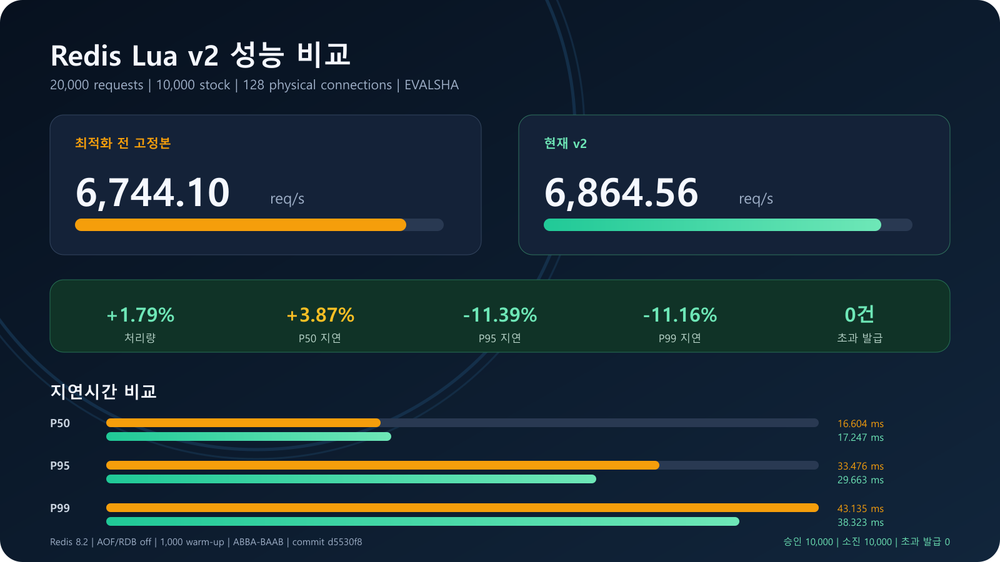

# Redis Lua v2 성능 비교

## 측정 기준

- 측정 일시: 2026-08-16 (KST)
- 대상 브랜치: `feat/13-redis-lua-logic`
- 대상 커밋: `d5530f8`
- 최적화 전: `src/test/resources/scripts/coupon-issue-before-optimization.lua` 고정본
- 최적화 후: v2 정합성·보상 방어가 반영된 현재 `src/main/resources/scripts/coupon-issue.lua`

## 측정 결과

| 버전 | 처리량 | P50 | P95 | P99 | 최대 지연 |
|---|---:|---:|---:|---:|---:|
| 최적화 전 고정본 | 6,744.10 req/s | 16.604 ms | 33.476 ms | 43.135 ms | 73.595 ms |
| 현재 v2 | 6,864.56 req/s | 17.247 ms | 29.663 ms | 38.323 ms | 52.924 ms |
| 변화 | **+1.79%** | **3.87% 증가** | **11.39% 감소** | **11.16% 감소** | **28.09% 감소** |

20,000건 요청과 10,000장 재고에서 두 버전 모두 승인 10,000건, 재고 소진 10,000건, 초과 발급 0건을 확인했다. 최종 재고, Bitmap bit 수, 발급 순번, Stream 엔트리 수도 승인 수와 일치했다.

현재 v2는 P50이 3.87% 증가했지만 처리량은 1.79% 개선됐고, 대규모 트래픽에서 중요한 P95·P99·최대 지연은 각각 11.39%, 11.16%, 28.09% 감소했다. 이는 단순 최소 명령어 버전보다 정합성 방어를 강화하면서도 tail latency를 낮춘 결과다.



## 현재 v2 반영 내용

- `v2|userId|segmentId|offset|decisionCode|lifecycle|sequence|remaining|decidedAt|updatedAt` 요청 상태 저장
- 동일 requestId 재시도 시 사용자·Bitmap 세그먼트·오프셋 불변성 검증
- 총재고·Bitmap 세그먼트 크기·스키마·시간 범위·순번 손상 검증
- `pcall`과 반환값 검증 기반 쓰기 오류 식별
- HSET·XADD·SETBIT·DECR·INCR 부분 실패 시 역순 롤백
- Stream ISSUE 이벤트에 타입·Bitmap 세그먼트·오프셋 포함
- 저장 대기 요청의 Bitmap 중복 차단과 보상 lifecycle 구분

이 검증과 더 긴 상태·Stream payload 때문에 경량 v1 스크립트보다 hot path 비용이 증가했다. 대신 잘못된 보상 위치, 부분 쓰기, 손상된 재고를 명확히 차단한다.

## 측정 방법

- Redis 8.2 전용 벤치마크 프로필, 호스트 포트 6380
- Lua 실행 비용 격리용 AOF/RDB 비활성화
- 요청 20,000건, 재고 10,000장, 물리 Lettuce 연결 128개
- Lua SHA 사전 로드 후 `EVALSHA` 호출
- 각 버전 1,000건 warm-up
- 실행 순서 편향 완화용 ABBA-BAAB 교차 실행
- 각 라운드 종료 후 재고·Bitmap·순번·Stream 정합성 검증

이 결과는 HTTP, JSON 직렬화, Spring MVC, MySQL, Kafka 비용을 제외한 Redis Lua 판정 구간 전용 벤치마크다. 전체 API TPS는 JMeter 부하 테스트로 별도 측정해야 한다.

## 이전 문서 수치와의 차이

기존 문서의 8,069.51 req/s는 요청 상태 6필드와 축소된 검증을 사용하던 경량 v1 스크립트 결과다. 현재 v2와 동일한 코드가 아니므로 절대 처리량을 직접 비교할 수 없다.

또한 문서 작성 당시와 현재의 최적화 전 고정본은 동일하지만 처리량이 7,549.12 req/s에서 6,744.10 req/s로 10.66% 달랐다. 이 차이는 측정 시점의 Docker Desktop 자원, 호스트 부하, JVM·OS 스케줄링 등 실행 환경 편차를 보여준다. 따라서 성능 판단은 다른 날짜의 절대값보다 동일 실행 안의 전후 상대 비교를 기준으로 한다.

## 재현 방법

```powershell
docker compose --profile benchmark up -d redis-benchmark
./gradlew.bat redisLuaBenchmark --no-daemon --rerun-tasks "-Dbenchmark.mode=compare" "-Dbenchmark.requests=20000" "-Dbenchmark.workers=128"
```

실행 결과:

- HTML 리포트: `build/reports/redis-lua-benchmark/index.html`
- 수치 원본: `build/reports/redis-lua-benchmark/results.csv`
- 최적화 전 리포트: `build/reports/redis-lua-benchmark/before/index.html`
- 현재 v2 리포트: `build/reports/redis-lua-benchmark/after/index.html`
- Gradle 테스트 리포트: `build/reports/tests/redisLuaBenchmark/index.html`
- 발표용 이미지: `docs/performance/redis-lua-performance.png`

정합성 테스트는 AOF가 활성화된 일반 개발 Redis 6379에서 별도 실행한다.

```powershell
./gradlew.bat redisIntegrationTest --no-daemon
```
